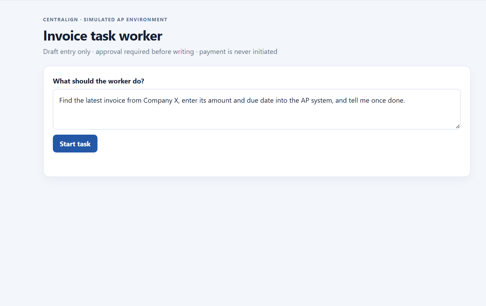
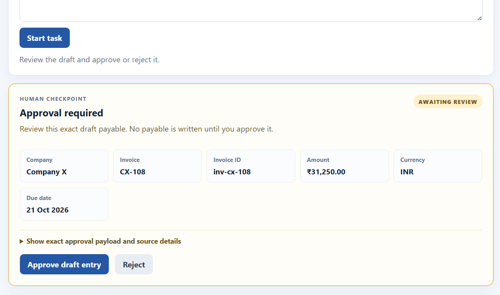
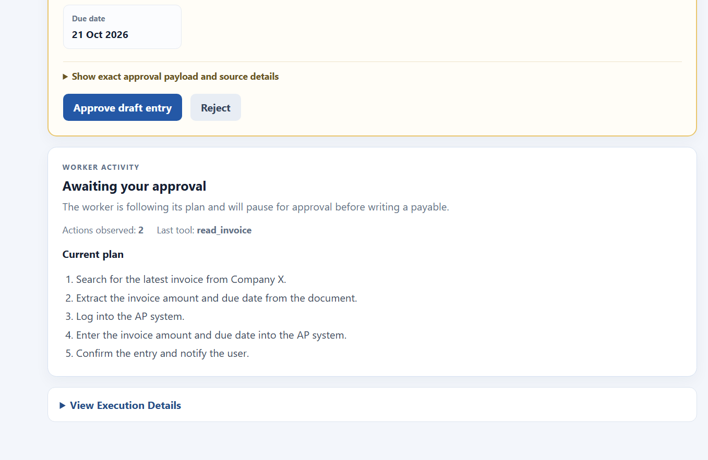
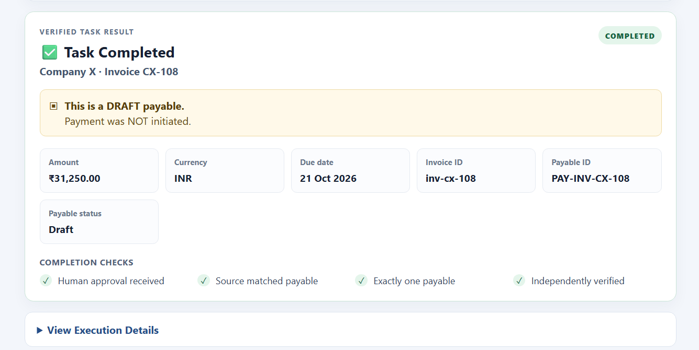
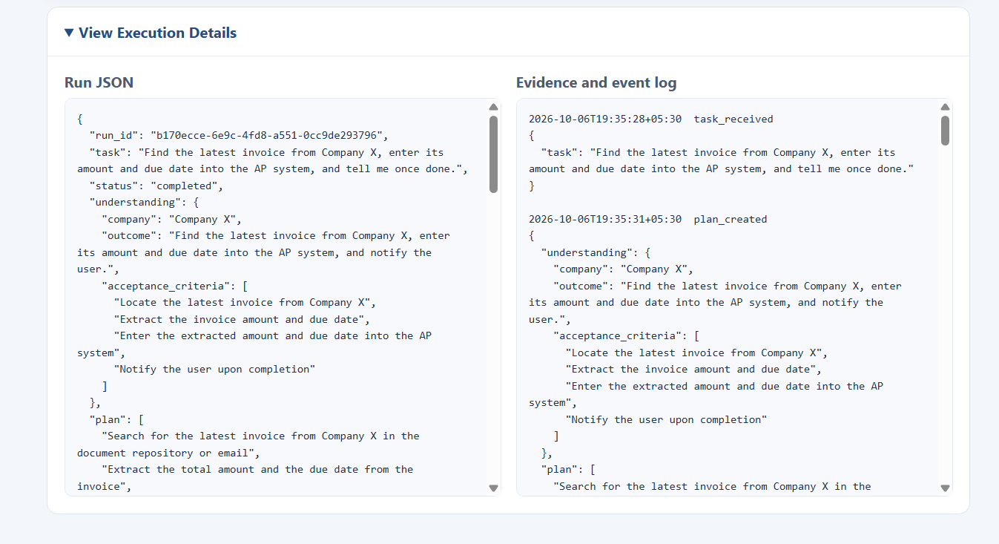
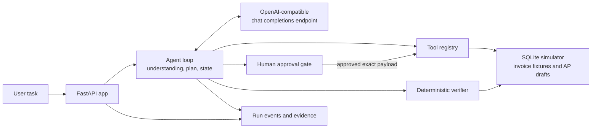

# Simulated Invoice Task Worker

A narrow, local prototype of a business-task worker. It accepts a natural-language invoice task, plans and selects tools from observed results, requests approval before a payable write, reconciles an uncertain write, verifies the stored result, and returns an event log as evidence.

The AP system is simulated. It creates draft entries only; it never sends payments or connects to a real company system.

## Demo video

Watch the [4:05.97 edited demo draft](docs/demo-video.mp4) to see the invoice task worker complete a simulated task, pause for human approval, recover from an ambiguous timeout, verify the draft payable, and walk through the README and repository.

## Project structure

```text
centralign-invoice-worker/
├── .env.example            # Safe environment-variable reference
├── .gitignore               # Excludes secrets, runtime data, and local caches
├── README.md                # Setup, workflow, and demo documentation
├── agent.py                 # Task understanding, planning, tool loop, and state transitions
├── app.py                   # FastAPI application and web UI
├── llm.py                   # Provider-agnostic OpenAI-compatible chat adapter
├── requirements.txt         # Python dependencies
├── simulator.py             # Synthetic invoices and simulated AP tools
├── store.py                 # SQLite-backed run state and event persistence
├── docs/
│   ├── demo-video.mp4       # Edited 4:05.97 project walkthrough
│   └── images/              # README screenshots of the workflow
│       ├── approval-plan.png
│       ├── approval-review.png
│       ├── completed-result.png
│       ├── execution-details.png
│       └── task-entry.png
├── tests/
│   └── test_workflow.py    # End-to-end workflow and recovery tests
```

The local `runtime/` directory is created as needed for SQLite data and is ignored by Git.

## Screenshots

These screenshots show one simulated invoice task from initial request through human review, completion, and the retained execution evidence. The workflow creates a draft payable only; it does not initiate payment.

### Task submission

Enter the requested business outcome in natural language. The worker then interprets the task and follows its plan using the available tools.



### Human approval checkpoint

Before writing a payable, the UI presents the selected invoice fields for review. The worker pauses here until the user approves or rejects the exact draft.



The activity panel shows the current plan and the last observed tool while the task waits for approval.



### Verified completion and execution evidence

After approval, the result card summarizes the draft payable and verification checks. It clearly states that payment was not initiated.



The expandable execution details retain the underlying run JSON and event log for inspection.



## Architecture



The model proposes the next allowed action after each observation. Python enforces the tool allowlist, arguments, approval gate, action limit, and reconciliation rules. The verifier checks simulator state independently of the model's completion claim.

## Requirements

- Python 3.10 or newer.
- An endpoint that supports OpenAI-compatible `/v1/chat/completions` requests and JSON mode. The recommended live-demo configuration is Google Gemini; Ollama is also supported as a local alternative.
- PowerShell examples below assume the repository root is the directory containing `app.py` and `requirements.txt`.

The submitted workflow was validated with Google Gemini 3.5 Flash Lite through Google's OpenAI-compatible API endpoint. The FastAPI application uses a provider-agnostic LLM adapter and sends JSON-mode chat-completions requests; it does not use Gemini native function calling. Ollama documents its local OpenAI-compatible chat-completions endpoint and JSON mode. See [Ollama OpenAI compatibility](https://docs.ollama.com/api/openai-compatibility).

## Environment variables

The application reads environment variables from the process that starts it. It does **not** automatically load a `.env` file; `.env.example` is a reference file. Set the values in your shell as shown below.

| Variable | Required? | Default | Purpose |
|---|---|---|---|
| `LLM_BASE_URL` | No, if using the defaults | `http://localhost:11434/v1` | Base URL for an OpenAI-compatible endpoint. Use the `/v1` base URL, or provide a complete `/chat/completions` URL. |
| `LLM_MODEL` | No, if using the defaults | `qwen2.5:7b` | Model identifier understood by the selected endpoint. |
| `LLM_API_KEY` | Only if the endpoint requires one | Empty | Bearer token for the selected endpoint; leave empty for a local endpoint that does not require authentication. Do not commit a real key. |
| `INVOICE_WORKER_DB` | No | `runtime/app.sqlite3` in the repository | SQLite file for simulator data, task state, and events. |
| `SIMULATE_COMMIT_TIMEOUT` | No | `true` | When true, the first draft write in each run commits and then reports an ambiguous timeout for recovery. |

The first three variables configure any supported OpenAI-compatible endpoint: `LLM_BASE_URL` selects the endpoint, `LLM_MODEL` selects its model, and `LLM_API_KEY` supplies a Bearer token when required. They have defaults for the local Ollama setup, so no LLM variables are mandatory when using those defaults. Set the variables for Gemini or another compatible service as shown below.

## Setup (Windows PowerShell)

From the repository root:

```powershell
python -m venv .venv
.\.venv\Scripts\Activate.ps1
python -m pip install -r requirements.txt
```

Choose one of the endpoint configurations below, then open [http://127.0.0.1:8000](http://127.0.0.1:8000) after Uvicorn starts.

### Live Demo with Google Gemini

The submitted workflow was validated using Google Gemini 3.5 Flash Lite through Google's OpenAI-compatible API endpoint. The application sends JSON-mode chat completions to that endpoint through its provider-agnostic LLM adapter.

Set the following variables in PowerShell from the repository root. Replace `<YOUR_GEMINI_API_KEY>` with your own Gemini API key before running the app. Only the placeholder is shown here; the repository does not include your private key. Enter your key locally and never commit or share it.

```powershell
$env:LLM_BASE_URL = "https://generativelanguage.googleapis.com/v1beta/openai"
$env:LLM_MODEL = "gemini-3.5-flash-lite"
$env:LLM_API_KEY = "<YOUR_GEMINI_API_KEY>"
$env:SIMULATE_COMMIT_TIMEOUT = "true"
$env:INVOICE_WORKER_DB = (Join-Path (Get-Location) "runtime\gemini-demo.sqlite3")
Remove-Item $env:INVOICE_WORKER_DB -ErrorAction SilentlyContinue

uvicorn app:app --reload
```

The Gemini endpoint and model must be available to your API key and support the JSON-mode chat-completions request used by the adapter.

### Alternative: Run with Ollama

Ollama is a local alternative for users who prefer to run a model on their own machine. It was not the model used for the submitted live validation. Start Ollama and pull the model once:

```powershell
ollama pull qwen2.5:7b
```

Then configure and run the app from the repository root:

```powershell
$env:LLM_BASE_URL = "http://localhost:11434/v1"
$env:LLM_MODEL = "qwen2.5:7b"
$env:LLM_API_KEY = ""
$env:SIMULATE_COMMIT_TIMEOUT = "true"
$env:INVOICE_WORKER_DB = (Join-Path (Get-Location) "runtime\app.sqlite3")

uvicorn app:app --reload
```

Keep the Ollama endpoint running while using this option. Other OpenAI-compatible services can be configured by setting `LLM_BASE_URL`, `LLM_MODEL`, and `LLM_API_KEY` for that service; no application architecture change is needed when it accepts the request's JSON mode and returns the usual chat-completions response shape.

## Reset the simulated company database

The SQLite file persists invoices, drafts, runs, and events. Use a new filename for a clean demo. Stop the server first if you are reusing a filename.

```powershell
$env:INVOICE_WORKER_DB = (Join-Path (Get-Location) "runtime\demo-clean.sqlite3")
Remove-Item $env:INVOICE_WORKER_DB -ErrorAction SilentlyContinue
uvicorn app:app --reload
```

The application creates the parent directory and seeds the invoice fixtures on startup. Use the same `INVOICE_WORKER_DB` value when restarting if you want to inspect previous runs; choose a new filename or remove the old file to replay a fresh run and its injected timeout.

## Live demo steps

Live validation: The submitted workflow was validated using Google Gemini 3.5 Flash Lite through Google's OpenAI-compatible API endpoint.

For the recommended demo, follow **Live Demo with Google Gemini** above, replace the API-key placeholder with your own key, use the fresh database path, and start Uvicorn. Confirm the endpoint and model are available before recording.

1. Start Uvicorn using the Gemini configuration above, then open the local page and submit:

   > Find the latest invoice from Company X. Extract its invoice number, amount, currency, and due date. Enter it as a draft payable. Do not pay it, and tell me once it is verified.

2. Show the task understanding, initial plan, invoice search results, selected latest invoice, and extracted invoice fields.
3. Review the proposed draft at the approval checkpoint and approve it. No payable is written before approval.
4. Show the write timeout observation, the agent's next lookup action, the verifier result, and the final summary with run events/evidence.

## Injected timeout and recovery

With `SIMULATE_COMMIT_TIMEOUT=true` (the default), `create_payable` commits the draft to the simulated AP database and then returns `timeout_outcome_unknown` for the first write in that run. This is a deliberate, repeatable fault injection: the write may have succeeded even though the caller saw a timeout. The agent is expected to observe that result, look up the payable before retrying, and continue from the actual simulator state. The idempotency key and unique source-invoice constraint prevent duplicate drafts. Set `SIMULATE_COMMIT_TIMEOUT=false` to disable this scenario.

## Approval gate and verification

- The proposed payable is presented for explicit human approval before `create_payable` can run. The approval is bound to the exact payload hash; rejection leaves the payable table unchanged.
- The verifier is deterministic Python code. It checks that the chosen invoice is the latest received invoice for the requested company, payable fields match canonical fixture data, the payable is a draft, exactly one payable exists for the invoice, and approval evidence exists.
- Verification does not trust the model's completion statement. It reads the simulator database directly. Since this is a simulator, it is independent of the LLM but not an independent production accounting system.

## Tools

- `search_invoices(company)` returns candidate invoice IDs and received timestamps.
- `read_invoice(invoice_id)` returns the selected fixture's document text.
- `create_payable(...)` writes an idempotent draft after approval.
- `lookup_payable(invoice_id)` reads drafts back for reconciliation.

Task context, tool calls, observations, approval, plan updates, and verification results are persisted in SQLite and exposed in the run log.

## Tests

Run from the repository root:

```powershell
python -m unittest discover -s tests -v
```

The workflow tests use an observation-driven test model rather than a canned application response. They cover the API, approval/rejection, commit-then-timeout reconciliation, idempotency, verifier rejection of incorrect fields, and OpenAI-compatible request configuration. These tests do not replace a live-model demo: a real endpoint and available model are required to verify live behavior.

## Simulator limitations

- Invoice data is static synthetic text, not email, PDF, OCR, or an external document store.
- The AP system is a local SQLite simulation, not a real ERP/accounting integration.
- The only write is a draft payable; no payment, email, or external side effect occurs.
- The timeout is injected by the simulator; it does not represent a measured production outage.
- The agent is narrowly configured for invoice intake and the registered tools. It is not a general-purpose business agent.
