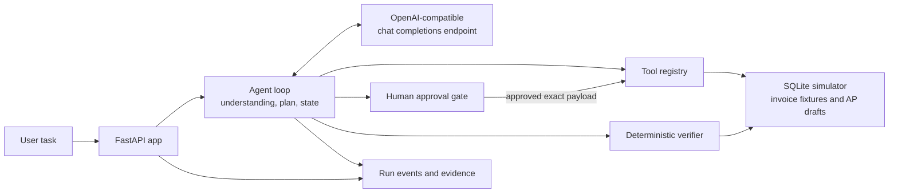

# Simulated Invoice Task Worker

A narrow, local prototype of a business-task worker. It accepts a natural-language invoice task, plans and selects tools from observed results, requests approval before a payable write, reconciles an uncertain write, verifies the stored result, and returns an event log as evidence.

The AP system is simulated. It creates draft entries only; it never sends payments or connects to a real company system.

## Architecture



The model proposes the next allowed action after each observation. Python enforces the tool allowlist, arguments, approval gate, action limit, and reconciliation rules. The verifier checks simulator state independently of the model's completion claim.

## Requirements

- Python 3.10 or newer.
- Ollama with a model available locally, or another endpoint that supports OpenAI-compatible `/v1/chat/completions` and JSON mode.
- PowerShell examples below assume the repository root is the directory containing `app.py` and `requirements.txt`.

Ollama documents its local OpenAI-compatible chat-completions endpoint and JSON mode. Its usual local base URL is `http://localhost:11434/v1`. See [Ollama OpenAI compatibility](https://docs.ollama.com/api/openai-compatibility).

## Environment variables

The application reads environment variables from the process that starts it. It does **not** automatically load a `.env` file; `.env.example` is a reference file. Set the values in your shell as shown below.

| Variable | Required? | Default | Purpose |
|---|---|---|---|
| `LLM_BASE_URL` | No, if using the default | `http://localhost:11434/v1` | API root for the compatible endpoint. Use the `/v1` base URL, or provide a complete `/chat/completions` URL. |
| `LLM_MODEL` | No, if using the default | `qwen2.5:7b` | Model identifier understood by the endpoint. |
| `LLM_API_KEY` | Only if the endpoint requires one | Empty | Sent as a Bearer token when non-empty. Do not commit a real key. |
| `INVOICE_WORKER_DB` | No | `runtime/app.sqlite3` in the repository | SQLite file for simulator data, task state, and events. |
| `SIMULATE_COMMIT_TIMEOUT` | No | `true` | When true, the first draft write in each run commits and then reports an ambiguous timeout for recovery. |

There are no mandatory LLM environment variables because the first three have defaults. Set `LLM_BASE_URL` and `LLM_MODEL` when using a different endpoint or model; set `LLM_API_KEY` only when that endpoint requires authentication.

## Setup and start (Windows PowerShell)

From the repository root:

```powershell
python -m venv .venv
.\.venv\Scripts\Activate.ps1
python -m pip install -r requirements.txt

# Install/pull the model once, in another terminal if Ollama is not already running:
ollama pull qwen2.5:7b

$env:LLM_BASE_URL = "http://localhost:11434/v1"
$env:LLM_MODEL = "qwen2.5:7b"
$env:LLM_API_KEY = ""
$env:SIMULATE_COMMIT_TIMEOUT = "true"
$env:INVOICE_WORKER_DB = (Join-Path (Get-Location) "runtime\app.sqlite3")

uvicorn app:app --reload
```

Keep the local model endpoint running. Then open [http://127.0.0.1:8000](http://127.0.0.1:8000). For a different OpenAI-compatible service, change `LLM_BASE_URL` and `LLM_MODEL`; set `LLM_API_KEY` in the same shell if it requires a key. No application architecture change is needed as long as the endpoint accepts the request's JSON mode and returns the usual chat-completions response shape.

## Reset the simulated company database

The SQLite file persists invoices, drafts, runs, and events. Use a new filename for a clean demo. Stop the server first if you are reusing a filename.

```powershell
$env:INVOICE_WORKER_DB = (Join-Path (Get-Location) "runtime\demo-clean.sqlite3")
Remove-Item $env:INVOICE_WORKER_DB -ErrorAction SilentlyContinue
uvicorn app:app --reload
```

The application creates the parent directory and seeds the invoice fixtures on startup. Use the same `INVOICE_WORKER_DB` value when restarting if you want to inspect previous runs; choose a new filename or remove the old file to replay a fresh run and its injected timeout.

## Live demo steps

1. Start the configured local or hosted compatible model endpoint and confirm the selected model is available.
2. Set the environment variables, select a fresh database path as above, and start Uvicorn.
3. Open the local page and submit:

   > Find the latest invoice from Company X. Extract its invoice number, amount, currency, and due date. Enter it as a draft payable. Do not pay it, and tell me once it is verified.

4. Show the task understanding, initial plan, invoice search results, selected latest invoice, and extracted invoice fields.
5. Review the proposed draft at the approval checkpoint and approve it. No payable is written before approval.
6. Show the write timeout observation, the agent's next lookup action, the verifier result, and the final summary with run events/evidence.

## Injected timeout and recovery

With `SIMULATE_COMMIT_TIMEOUT=true` (the default), `create_payable` commits the draft to the simulated AP database and then returns `timeout_outcome_unknown` for the first write in that run. This is a deliberate, repeatable fault injection: the write may have succeeded even though the caller saw a timeout. The agent is expected to observe that result, look up the payable before retrying, and continue from the actual simulator state. The idempotency key and unique source-invoice constraint prevent duplicate drafts. Set `SIMULATE_COMMIT_TIMEOUT=false` to disable this scenario.

## Approval gate and verification

- The proposed payable is presented for explicit human approval before `create_payable` can run. The approval is bound to the exact payload hash; rejection leaves the payable table unchanged.
- The verifier is deterministic Python code. It checks that the chosen invoice is the latest received invoice for the requested company, payable fields match canonical fixture data, the payable is a draft, exactly one payable exists for the invoice, and approval evidence exists.
- Verification does not trust the model's completion statement. It reads the simulator database directly. Since this is a simulator, it is independent of the LLM but not an independent production accounting system.

## Tools

- `search_invoices(company)` returns candidate invoice IDs and received timestamps.
- `read_invoice(invoice_id)` returns the selected fixture's document text.
- `create_payable(...)` writes an idempotent draft after approval.
- `lookup_payable(invoice_id)` reads drafts back for reconciliation.

Task context, tool calls, observations, approval, plan updates, and verification results are persisted in SQLite and exposed in the run log.

## Tests

Run from the repository root:

```powershell
python -m unittest discover -s tests -v
```

The workflow tests use an observation-driven test model rather than a canned application response. They cover the API, approval/rejection, commit-then-timeout reconciliation, idempotency, verifier rejection of incorrect fields, and OpenAI-compatible request configuration. These tests do not replace a live-model demo: a real endpoint and available model are required to verify live behavior.

## Simulator limitations

- Invoice data is static synthetic text, not email, PDF, OCR, or an external document store.
- The AP system is a local SQLite simulation, not a real ERP/accounting integration.
- The only write is a draft payable; no payment, email, or external side effect occurs.
- The timeout is injected by the simulator; it does not represent a measured production outage.
- The agent is narrowly configured for invoice intake and the registered tools. It is not a general-purpose business agent.
